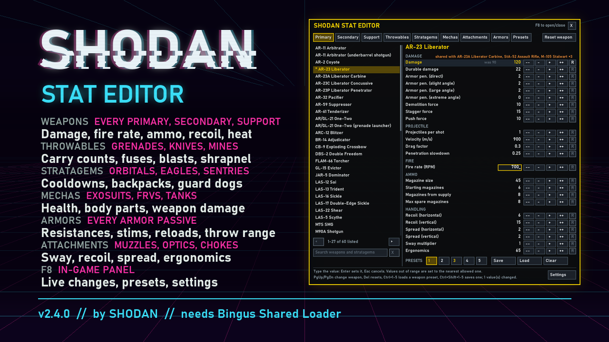

# SHODAN Stat Editor

An in-game panel for **Helldivers 2** that changes the stats of weapons, throwables, stratagems,
mechas, attachments and armor passives while you play. Press **F8**, pick one, and change its numbers. Changes apply at once, are
saved, and are applied again automatically every time the game starts. Keep setups as presets:
5 per weapon, and up to 50 named ones for everything you have changed.

**[Download the latest release](../../releases/latest)** · Requires **Bingus Shared Loader** (v15 or newer)



## What you can change

**Weapons**: every primary, secondary and support weapon

| Section | Stats |
|---|---|
| Damage | Damage, durable damage, armor penetration (direct, slight, large and extreme angle), demolition force, stagger force, push force (from the bullet, beam, flame, arc or melee strike) |
| Projectile | Projectiles per shot, velocity, drag factor, penetration slowdown |
| Explosion | Inner, outer and shockwave radius of the blast (grenade launchers and pistols, EATs, recoilless, Autocannon, Eruptor and every other weapon with explosive rounds); the Breaching Hammer's explosion also has its full damage set |
| Arc | Range, chain length, chain split (Arc Thrower, Blitzer, K-9 Guard Dog, Tesla Tower) |
| Burning / Gas | How much fire or gas each hit applies (flamethrowers, Coyote, Hyena, incendiary shotguns, lasers, EAT-700, gas weapons); burn / gas damage, armor penetration and duration |
| Fire | Fire rate (every fire mode the weapon has) |
| Ammo | Magazine size, starting magazines, magazines from supply, max spare magazines (or rounds, for weapons loaded by the round), reload time, rounds per reload and reload allowed below (clip weapons) |
| Handling | Recoil (horizontal, vertical), spread (horizontal, vertical), sway, ergonomics |
| Heat | Overheat threshold, heat per shot / per second, cool-down time (lasers, Quasar Cannon), heatsinks |
| Projectile swap | The projectile the weapon fires: pick another weapon's (by name, or type its id) |
| Grenade swap | Fire a throwable grenade, Dynamite or a throwable mine from a grenade launcher or pistol, the One-Two's launcher or the Grenadier Battlement (solo missions) |

Beam weapons (Scythe, Dagger, Trident, Laser Cannon, Meltagun) get their damage from their beam,
flame weapons (Flamethrower, Torcher, Crisper, Cremator, Sterilizer) from their spray, arc weapons
from their arc and melee weapons (Breaching Hammer, Machete, Saber, ...) from their strike; all
are fully supported. A flamer's **Damage** is what each flame hit does.

**Burning and gas are shared.** "Burning applied per hit" belongs to the weapon; the **Burning**
(or **Gas**) section below it is the effect itself, shared by every source of it in the game,
enemies' fire included. To make one weapon burn harder, raise its own values.

**Cool-down time** is shown in seconds: how long a full heat bar takes to cool to zero. Setting it
sets the cooling rate, so raising the overheat threshold also lengthens it. The Quasar Cannon's
recharge is its "cool-down time after overheat".

**Grenade swap**: pick the grenade by name with - / +; 0 is the launcher's own round. The
grenade's assets load first, so the choice applies a second or two later. Ammo, fire rate and
handling stay the launcher's; edit the grenade itself on the Throwables tab. A grenade choice
takes priority over Projectile swap.

**Throwables**: all 23 grenades, knives, throwable mines and the shield, on the Throwables tab

| Section | Stats |
|---|---|
| Throwable | Starting count, max carried, from supply, max throw distance, fuse time (timed ones) |
| Explosion | The full damage set above, inner / outer / shockwave radius, and the burning or gas it applies (incendiary and gas grenades) |
| Shrapnel | Pieces, their damage and velocity (G-6 Frag, TM-1 Lure Mine); the G-7 Pineapple's bomblets and their explosion |
| Arc / Damage | The G-31 Arc's arc (range, chain length, split, damage); the K-2 Throwing Knife's hit |

**Stratagems**

| Stratagem | Stats |
|---|---|
| All | Cooldown, and uses where limited |
| Eagles | Uses per rearm, Eagle rearm time; time between bombs (bombers), fire duration (Strafing Run, 110mm Rocket Pods), run length |
| Orbital and Eagle strikes | For every projectile and blast they use: velocity, inner / outer / shockwave radius, and the full damage set above |
| Orbital barrages and strikes | Salvos, shells per salvo, time between shells, time between salvos, spread area; the Walking Barrage's walking speed |
| Orbital Laser | Duration, tracking speed, search radius, damage tick |
| Guard Dogs (AR-23, Rover, Dog Breath, Hot Dog, K-9) | The drone's health, spotting range and target search interval, and the gun it carries, stat for stat like a weapon |
| Sentries and emplacements (all ten sentries, HMG and Anti-Tank Emplacements, Grenadier Battlement) | Cooldown, health, spotting range, target search interval, turret turn speed, and their weapon stat for stat (the Tesla Tower's arc included) |
| Anti-Personnel, Anti-Tank, Gas and Incendiary Minefields | Panels and mines per panel (lower only), arming time, throw velocity and spread; the mines' trigger and chain reaction delays, their explosion's damage and radii |
| LIFT-850 Jump Pack, LIFT-860 Hover Pack | Recharge time, launch force, takeoff duration, forward share of the launch, landing thrust force and duration, mid-air steering; the Hover Pack's hover duration |
| LIFT-182 Warp Pack | Warp distance, reach up / down, heat per warp, cooling, safe and unsafe heat, the damage an unsafe warp does to you and its explosion |
| Supply Pack, Portable Hellbomb, Guard Dogs; the ammo backpacks of the Autocannon, Recoilless Rifle, Spear, W.A.S.P., Airburst, Maxigun, Cremator and Belt-Fed GL (on the weapon's page) | Backpack charges: capacity, at the start, from resupply |

A backpack reads its values when it is called in: edit them, then call in a new one.

How far a Guard Dog flies from you is decided by its behaviour in the game code, not by the data
the panel edits, so it can't be changed. The AR-23 dog's bullet is the Liberator Penetrator's and
the Hot Dog's flame damage is the Torcher's; the panel notes values that change together.

**Mechas**: the exosuits, FRVs and tanks, on the Mechas tab

| Mecha | Stats |
|---|---|
| Exosuits (Patriot, Emancipator, Lumberer, Breacher), FRVs (Gunner, Supply, Incinerator), tanks (Bastion, Maelstrom) | Cooldown, health and armor; the health and armor of every body part (legs, cockpit, tracks, doors, ...) |
| Their weapons (the arms, turrets and guns) | Each an entry of its own, stat for stat like a weapon |

Body parts whose names aren't known show as "Part N". The Breacher's left arm is a shield whose
hit is an ability, not a weapon stat, so it has no damage to change.

**Attachments**: optics, underbarrels, muzzles and ammunition types, on the Attachments tab

| Attachment | Stats |
|---|---|
| Optics, underbarrels, muzzles (weapons' own Custom muzzle brakes included), shotgun chokes | Ergonomics bonus, and where the attachment has them: sway, recoil (horizontal, vertical), recoil climb (horizontal, vertical) and spread (horizontal, vertical) multipliers |
| Ammunition types (94, alternate loads included), by their names in game | Recoil and spread multipliers |

An attachment's values apply to every weapon fitted with it (an ammunition type's, to every
weapon loaded with it).

**Armor passives**: all 31, on the Armors tab

| Passive | Stats |
|---|---|
| Every armor passive (Fortified, Servo-Assisted, Med-Kit, Siege-Ready, Gunslinger, Democracy Protects, ...) | Every value it has: damage taken from explosions, fire, gas, arc, impacts and to the chest; extra stims and throwables; stim duration; reload speeds; ammo capacity; throw range; melee damage; limb health; noise and detection range; armor rating and ergonomics bonuses; and the weapon stat values some passives carry |

Multipliers show as the game stores them: 1 is no change, 0.5 damage taken is 50% resistance,
1.3 reload speed is 30% faster. A passive's values apply to every armor that has it.

## Install

1. Install **Bingus Shared Loader** (v15 or newer).
2. Download `SHODAN-Stat-Editor-v2.3.1.zip` from the [releases page](../../releases/latest).
3. Install the zip with your Helldivers 2 mod manager, like any other mod package.

## Use

Press **F8** in game to open or close the panel, or click its **X**. While it is open the game
gets none of your keys or mouse input, so typing never moves you or opens a game menu (this can
be turned off in Settings).

| Key | Action |
|---|---|
| Up / Down | Choose a stat |
| Left / Right | Change it (hold Shift for bigger steps) |
| Enter, or click a value | Type the value (Enter sets it, Esc cancels) |
| PgUp / PgDn | Previous / next weapon |
| Ctrl+F | Search (or click the box under the list) |
| Del | Reset the stat to the game's value |
| Ctrl+1–5 / Ctrl+Shift+1–5 | Load / save a weapon preset |

**Typing values.** Click a number (or press Enter on a stat) and type: digits, and "." or ","
for decimals. Enter sets it, Esc cancels, and clicking elsewhere also sets it. A value outside
what the stat can take is set to the nearest allowed one, and the panel says so.

Every change is saved to

```
%LOCALAPPDATA%\CowboyBingus\Helldivers2\StatEditor\config.txt
```

and applied again on every start, a few seconds after launch (on the title screen). Delete a
line, or the whole file, to go back to the game's values.

## Settings

The **Settings** button at the bottom right of the panel opens its options:

- **Open / close key**: click it and press the key you want (F1–F12, Insert, Home, End, Pause or
  Scroll Lock).
- **Block game input while open**: on by default.
- **Apply my changes**: turn it off to play with the game's own values; your changes are kept
  and come back when you turn it on.
- **Panel size**, **side** and **background opacity**.
- **Remember last tab and weapon**.
- **Reset all values**: every change of the current setup back to the game's values (asks
  "Sure?" first; click again to confirm).

The page also has the mod's version, a link to this page and the log file's location.

## Search

Click the box under the weapon list (or press Ctrl+F) and type: the list shows the weapons and
stratagems of every tab whose name holds all the words typed ("orb las" finds the Orbital
Laser). Enter keeps the results; Esc or **X** clears the search.

## Presets

**Weapon presets.** Every weapon and stratagem has 5. Use the PRESETS strip under its stats:
pick a number, then **Save** (its current values), **Load** or **Clear**. Numbers in gold hold a
preset. Loading one sets the weapon exactly as saved; anything the preset doesn't name goes back
to the game's value.

**Full presets.** Up to 50, on the **Presets** tab, each with a name you choose and every change
you have made.

- **+ New preset** saves your current changes as one, then you type its name (Enter keeps it,
  Esc cancels).
- **Load** replaces all current changes with the preset. **Save current changes here**,
  **Rename** and **Delete** work on the chosen one; overwriting and deleting ask twice.
- Keyboard on that tab: Up/Down choose, Enter loads, Insert makes a new one, Shift+Insert saves
  into the chosen one, F2 renames, Del deletes.

Presets are saved next to config.txt, as `weapon_presets.txt` and `preset_01.txt` …
`preset_50.txt`. A full preset file can be copied into another player's `StatEditor` folder to
share the whole setup.

## Good to know

- **Shared values.** Some weapons fire the same projectile or share its damage values (for
  example the Liberator, Liberator Carbine, StA-52 and Stalwart). The panel names the weapons
  that change along with the one you edit.
- **Projectile swap.** A weapon firing another weapon's projectile deals that projectile's damage
  and flies like it; fire rate, ammo and handling stay its own. To tune those shots, edit the
  other weapon's values (they change for both).
- **Variants.** Some weapons exist more than once in the game's data (a mounted copy, an
  underbarrel attachment). The list labels each one, and the panel says which copy
  you are editing.
- **Barrages** can use different shells for different rounds; the section names say which rounds
  a value belongs to. Long lists scroll: Up/Down follow the chosen stat, or use the buttons under
  the list.
- **Each magazine is edited on its own.** Weapons with several magazines or heatsinks list each
  one in a section of its own (size, spare magazines, reload time, heat, ergonomics bonus);
  changing one leaves the others as they are. A magazine some other weapons also use is shared
  with them, and its section names them. Values saved by older versions for the whole weapon
  carry over to its magazines.
- **Magazines hold at most 2048 rounds.** The game caps a magazine there (a bigger one drops to
  2048 at the first shot), so the editor stops at 2048 and says so if you go past it.
- **Custom muzzle brakes.** Seven weapons come with a muzzle brake of their own (Liberator
  Penetrator, Pacifier, Coyote, Adjudicator, Tenderizer, Hyena, Diligence Counter Sniper). Each is
  an entry on the Attachments tab, named after its weapon ("Muzzle brake (Liberator Penetrator)").
- The **armory** still shows the game's own numbers; the changes apply in play.
- **In multiplayer** your changes exist only in your game.
- **Other mods** that change the same stats will fight over them; use one or the other.
- **Nothing on disk is modified.** The mod changes the game's settings in memory while it runs.

## Reporting problems

Open an [issue](../../issues) and attach the log:

```
%LOCALAPPDATA%\CowboyBingus\Helldivers2\Logs\SHODANStatEditor.log
```

The log lists the tables the mod found, every stratagem it listed, and anything it could not
match, which is usually enough to find the cause.

## Credits

- **Bingus Shared Loader** by CowboyBingus, which runs the mod.
- **HD2Runtime** by Skyeshade, whose weapon and stratagem catalogs name the weapons and map
  every strike to its projectiles, blasts and damage, and whose research locates package loading
  and the live entity and unit layouts that Grenade swap uses.
- **[Filediver](https://github.com/xypwn/filediver)** and the **[helldivers.io](https://helldivers.io/)**
  data dump by shalzuth, for the game's data layouts and the armor passives.
- The **[Helldivers 2 wiki](https://helldivers.wiki.gg/)**, whose passive descriptions name every
  armor passive value.
- **DiverKit** and **HD2 HUD Plus**, which showed where the game's UI font lives.

## License

[GNU General Public License v3.0](LICENSE). You can use, change and share it, but anything
you distribute that is based on it must also be released under the GPL v3 with its source.

SHODAN Stat Editor is not affiliated with or endorsed by Arrowhead Game Studios or Sony
Interactive Entertainment.
